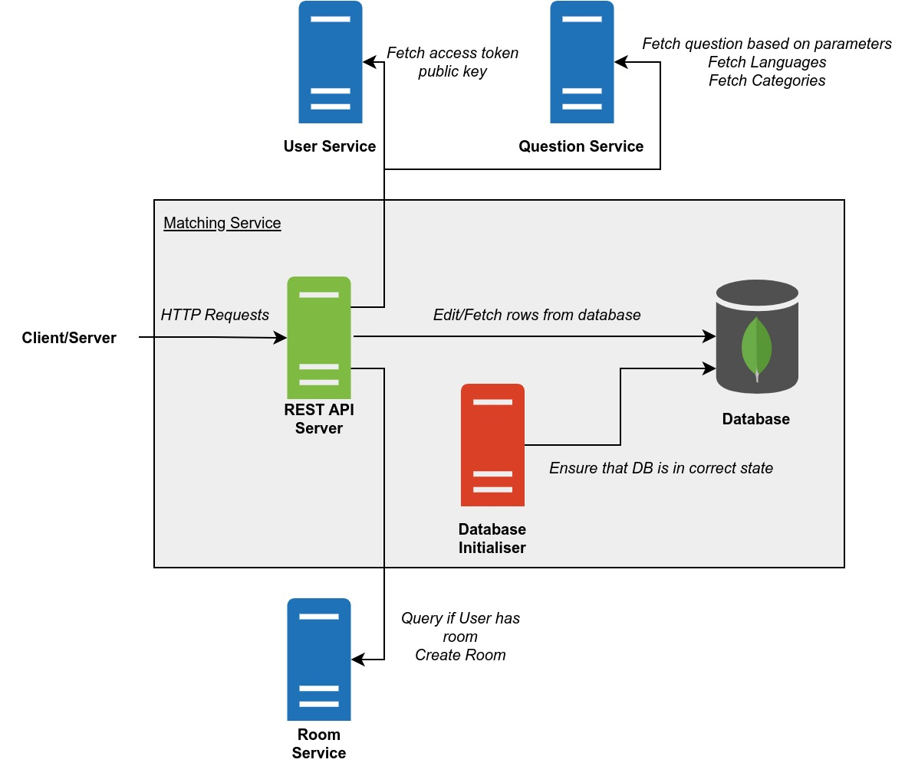

# PeerPrep Matching Service

Handles the matching of users.

- [Build Script](#build-script)
- [Architecture](#architecture)
- [Docker Images](#docker-images)
  - [API](#api)
  - [Database Initialiser](#database-initialiser)
- [Deployment](#deployment)
  - [Kubernetes Deployment](#kubernetes-deployment)
  - [Docker Compose Deployment](#docker-compose-deployment)
- [REST API](#rest-api)
  - [Check if a User is in the Queue](#check-if-a-user-is-in-the-queue)
  - [Add a User to the Queue](#add-a-user-to-the-queue)
  - [Remove a User from the Queue](#remove-a-user-from-the-queue)

## Build Script

`build_images.sh` is a build script for building the Docker images and optionally pushing them to the container registry. To get more information about the script, run:

```
./build_images.sh -h
```

## Architecture



Legend:

- Start of arrow indicates request origin and end of arrow indicates request destination.
- `#505050` Dark grey items represents internal servers/containers.
- `#DA4026` Red items represents internal servers/containers that are temporary.
- `#7FBA42` Green items represents internal servers/containers that are exposed.
- `#2072B8` Blue items represents external servers/containers.

**REST API Server**

- Handles REST API requests.
- Can be scaled horizontally.
- Corresponds to the [API](#api) docker image.

**Database Initialiser**

- Creates and sets up the collection to be use for storing matching information.
- Shuts down once it is done initialising the database.
- Corresponds to the [Database Initialiser](#database-initialiser) docker image.

**Database**

- Database for storing matching information.

## Docker Images

### API

**Name:** ghcr.io/cs3219-ay2324s1-g04/peerprep_matching_service_api

**Description:** Runs the REST API.

**Environment Variables:**

- `NODE_ENV` - Mode the app is running on ("development" or "production").
- `MS_EXPRESS_PORT` - Port to listen on.
- `MS_MONGO_URI` - URI for connecting to the Mongo database.
  - Example `mongodb://<user>:<pass>@<address>:<port>/<database>`
- `MS_MONGO_COLLECTION` - Name of the Mongo collection.
- `QUEUE_EXPIRY` - Number of milliseconds a user's matching request will remain in the queue before timing out. Due to this using Mongo's auto delete, collection may take up to one additional minute to get deleted.
- `SERVICE_USER_HOST` - Address of the User Service host.
- `SERVICE_USER_PORT` - Port the User Service is listening on.
- `SERVICE_QUESTION_HOST` - Address of the Question Service host.
- `SERVICE_QUESTION_PORT` - Port the Question Service is listening on.
- `SERVICE_ROOM_HOST` - Address of the Room Service host.
- `SERVICE_ROOM_PORT` - Port the Room Service is listening on.

### Database Initialiser

**Name:** ghcr.io/cs3219-ay2324s1-g04/peerprep_matching_service_database_initialiser

**Description:** Initialises the database by creating and setting up the necessary collections.

**Environment Variables:**

- `MS_MONGO_URI` - URI for connecting to the Mongo database.
  - Example `mongodb://<user>:<pass>@<address>:<port>/<database>`
- `MS_MONGO_COLLECTION` - Name of the Mongo collection.
- `QUEUE_EXPIRY` - Number of milliseconds a user's matching request will remain in the queue before timing out. Due to this using Mongo's auto delete, collection may take up to one additional minute to get deleted.

## Deployment

### Kubernetes Deployment

This is the main deployment method for production.

**Note:**

- The database is hosted externally, not within the Kubernetes cluster.

**Prerequisite**

- Docker images must be pushed to the container registry and made public.
  - To push to the container registry (assuming one has the necessary permissions), run: `./build_images.sh -p`
  - To make the images public, change the visibility of the image on [GitHub](https://github.com/orgs/CS3219-AY2324S1-G04/packages).
- Kubernetes cluster must be setup as specified in the [main repository](https://github.com/CS3219-AY2324S1/ay2324s1-course-assessment-g04#deployment).
- User Service, Question Service, and Room Service must be deployed within the Kubernetes cluster.

**Steps:**

1. Ensure the "peerprep" namespace has been created: `kubectl create namespace peerprep`
2. Navigate to the "kubernetes" directory: `cd kubernetes`
3. Deploy the Kubernetes objects: `./deploy.sh`
    - To delete the Kubernetes objects, run: `./delete.sh`

### Docker Compose Deployment

This is intended for development use only. It is meant to make developing other services easier.

**Note:**

- No horizontal auto scaling is provided.
- The database is created by Docker compose and data is not backed up.

**Prerequisite**

- Docker images must be built.
  - To build the images, run: `./build_images.sh`
- User Service, Question Service, and Room Service must be deployed via Docker compose.

**Steps:**

1. Ensure that the "peerprep" network exist: `docker network create -d bridge peerprep`
2. Create the docker containers: `docker compose up`
    - To delete the docker containers, run: `docker compose down`

## REST API

### Check if a User is in the Queue

> [GET] `/matching-service/queue/`

Checks if the user, who owns the specified access token, is in the queue.

**Cookies**

- `access-token` - Access token.

**Returns**

- `200` - { message: "In queue" }
- `303` - { message: "In room" }
- `401` - { message: "Not authorized" }
- `404` - { message: "Not in queue", data : { difficulty : string[], categories : string[], language : string[] } }
- `500` - { message: "Sever Error" }

### Add a User to the Queue

> [POST] `/matching-service/queue/join`

Adds the user, who owns the specified access token, to the queue.

The specified matching criteria are taken into account when matching users.

**Cookies**

- `access_token` - Access token.

**Parameters**

- `difficulty` - The complexity of the question.
- `categories[]` - The categories of the question - Can be multiple
- `language` - The programming language of the question

**Returns**

- `200` - { message: "Joined queue" }.
- `303` - { message: "In room" }
- `401` - { message: "Not authorized" }
- `409` - { message: "Already in queue" }
- `500` - { message: "Sever Error" }

**Examples**

Complexity and Categories provided
> `/matching-service/queue/join?difficulty=Easy&categories[]=Strings&categories[]=Arrays&language=cpp`
Will lead to paring with people of the same complexity and category and language.

No Complexity and no Categories provided, or bad request sent
> `/matching-service/queue/join`
Will lead to paring with people of the a randomized complexity and any category and python3 as language.


### Remove a User from the Queue

Removes the user, who owns the specified access token, from the queue.

> [DELETE] `/matching-service/queue/`

**Cookies**

- `access-token` - Access token.

**Returns**

- `200` - { message: "Received message" }.
- `401` - { message: "Not authorized" }
